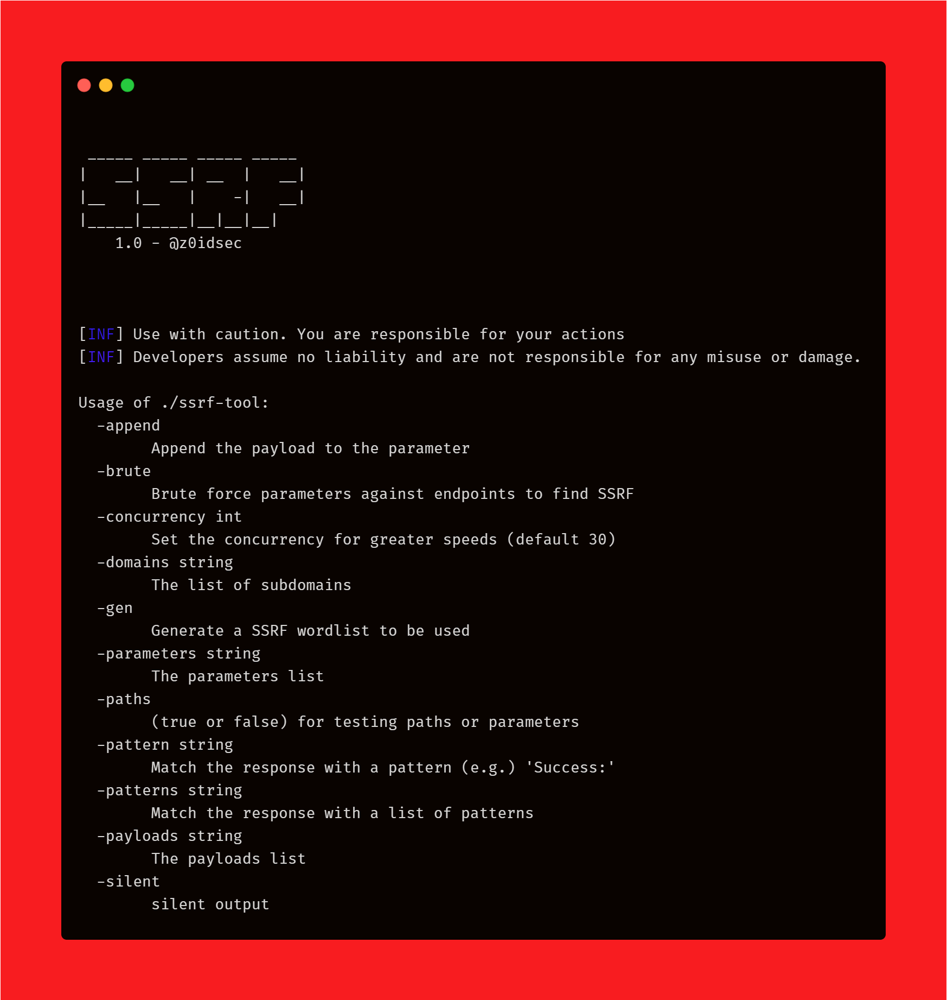
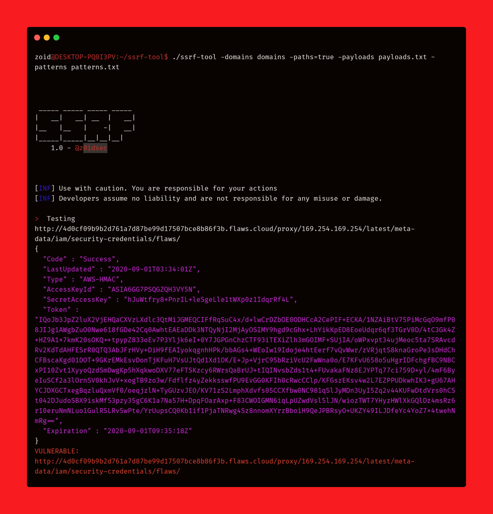

# 😎 SSRF-Detector 😎

A SSRF-Tool written in golang

**Version 1.0**

***
### 🔥 Upcoming Features 🔥
- Fetch endpoints from Javascript files ✅ 
- Bruteforce parameters ✅ 
- Find SSRF in those parameters ✅ 
- Match multiple patterns in the response ✅ 
- Check Post Request ❌

***
### Features
- Wordlist Creation
- Inject in every parameter one by one
- Very fast speed
- Inject into paths
- Silent Mode
- Fetch endpoints from Javascript files 
- Bruteforce parameters  
- Find SSRF in those parameters 
- Match multiple patterns in the response
***

### Note

***
Make sure when creating wordlists or finding ssrf with my tool that the domains are resolved.
You can use:
- httpx
- httprobe
- massdns

To do so. 
***

### Install

**`$ go get -u github.com/ethicalhackingplayground/ssrf-tool`**

***

  

***

### Find SSRF in paths with Subfinder,httpx
**`$ subfinder -d yahoo.com -silent | httpx -silent >> domains | ssrf-tool -domains domains -payloads ssrf.txt -silent=false -paths=true -patterns patterns.txt`**

***

***

### Wordlist Creation
**`$ echo "https://www.twitter.com" | getJS -complete | ssrf-tool -gen=true`**

**Can be used with other tools like subfinder & amass**

***

### BruteForce For SSRF
**`$ echo "https://www.twitter.com" | getJS -complete | ssrf-tool -domains domains -silent=false -brute=true -gen=true -patterns patterns.txt  -parameters params.txt`**

**Can be used with other tools like subfinder & amass**

***

### Testing The Paths
**`$ ssrf-tool -domains domains -silent=false -patterns patterns.txt -paths=true  -brute=false -payloads ssrf.txt`**

**Can be used with other tools like subfinder & amass**

### Testing Parameters with waybackurls
**`$ echo "twitter.com" | waybackurls >> domains  ; ssrf-tool -domains domains -silent=false -paths=false -payloads ssrf.txt`**

**Can be used with other tools like subfinder & amass**

***

**If you get a bounty please support by buying me a coffee**

 

